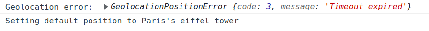
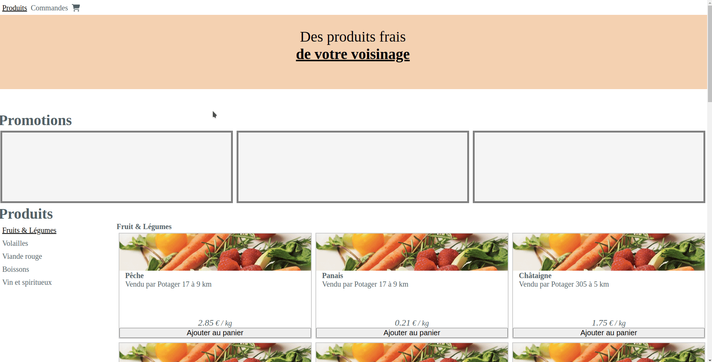
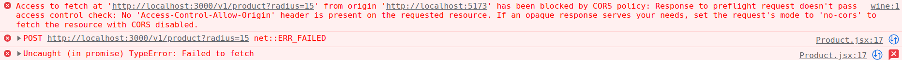

# Web API workshop

This workshop aims student of EPITA SIGL 2024.

In this workshop, you will learn how to:

- create a web API using [NodeJS](https://nodejs.org/en/) and [Express library](https://expressjs.com/)
- deploy a web API using Docker and your Scaleway instance
- consume a web API from client (in this case your reactive frontend from last workshop)

> Note: for this workshop, you will NOT use any databases.
> This will be the subject of another workshop.

## Step 0: Setup your backend from provided template

From your group's repository (e.g.: socra-groupXX):

- create a `backend` folder (same level as `frontend`)
- copy the template code inside `backend` folder [SOCRA-EPITA-SIGL-2024/web-api-template](https://github.com/SOCRA-EPITA-SIGL-2024/web-api-template)

> Warning: make sure you also copy both `.gitignore` and `.nvmrc` hidden files

You should have the following structure in your project repository (e.g. socra-groupXX):

```sh
backend/
├── .gitignore # contains files you don't want to push
├── .nvmrc  # make sure you run `nvm use` to match node 19
├── Dockerfile # your dockerfile for the web-api 
├── package.json  
├── package-lock.json 
└── src
    ├── data
    │   └── gardens.json # your data stored in a JSON file
    ├── distance.mjs    # contains code to compute distance between 2 GPS position
    └── server.mjs # your web api code
frontend/ # ... same as previous workshop
#...
```

Follow the [template README.md](https://github.com/) to make sure your application template runs correctly.

Your web api should listen on [localhost:3000](http://localhost:3000/).

If you go from your browser, you should see `{"status": "healthy"}`.

Alternatively, you can test it out with `cURL` from your terminal:

```sh
curl -XGET http://localhost:3000/
```

## Step 1 - **Challenge**: Expose gardens around a given position

**Objective**: From your web API, expose gardens around the input position

> Note: you will **not** care for discounts yet ("produits en promotion")

When copying the template, you've copied a file `src/data/garden.json` containing a big JSON file with 2000 gardens.

Each garden defines:

- a `title`
- an `id`
- a `position` with lat and lng GPS coordinates
- a `products` object with
  - `vegetable` a list of which fruits and vegetable are grown
  - `red_meat` a list of `beef` with meat `parts` the garden is selling
  - `wine`  a list of `wine` with `name` and `color` the garden is selling
  - `juice` a list of `juice` with `name` the garden is selling
  - `chicken` a list of actual `chicken` the garden is selling (not chicken meat but the chicken alive)

Here is an example of one garden with all type of products available:

```json
{
    "title": "Potager 25",
    "id": "u25",
    "position": {
      "lat": 48.342809,
      "lng": 2.056564
    },
    "products": {
      "vegetable": [
        {
          "name": "Concombre",
          "price": 0.77
        },
        {
          "name": "Pastèque",
          "price": 2.25
        },
        {
          "name": "Navet",
          "price": 0.02
        }
      ],
      "red_meat": [
        {
          "beef": {
            "name": "Blanc bleu"
          },
          "parts": [
            {
              "name": "Macreuse à bifteck",
              "price": 8.82
            },
            {
              "name": "Bavette d'aloyau",
              "price": 12.7
            },
            {
              "name": "Hampe",
              "price": 14.26
            },
            {
              "name": "Tendron, milieu de poitrine",
              "price": 15.08
            },
            {
              "name": "Tende de tranche ; poire, merlan",
              "price": 16.29
            }
          ]
        }
      ],
      "wine": [
        {
          "name": "Santenay",
          "color": "Rouge",
          "price": 3.33
        }
      ],
      "juice": [
        {
          "name": "Nectar de pêche",
          "price": 5.55
        }
      ],
      "chicken": [
        {
          "name": "Poule gasconne",
          "description": "Très bonne pondeuse",
          "price": 12.63
        },
        {
          "name": "Poule janzé",
          "description": "",
          "price": 11.13
        },
        {
          "name": "Poule la Flèche",
          "description": "Pour la chair (grande finesse), mixte (chair et ponte)",
          "price": 13.26
        }
      ]
    }
  }
```

Sometimes, some gardens doesn't contain all category of products. An empty list will be then shown to the product category.

Feel free to look at the data itself.

To do so, adapt the existing service from the template:

```js
app.post("/v1/product", function (request, response) {
  const inputPostion = request.body.position;
  const radius = +request.query.radius;
  // TODO: implement the service logic!
})
```

> Note: the `+` in front of `radius` makes sure that the request query option (after the `?`) is `cast` to an integer.
> Otherwise you would not filter the products correctly (e.g. 10 !== "10")

Here are some expample of query/response on your service:

- query gardens 10km around the eiffel tower (`"lat": 48.8583145, "lng": 2.292334`):

```sh
curl -XPOST -H "Content-Type: application/json" -d '{"position": {"lat": 48.856614,"lng": 2.3522219}}' http://localhost:3000/v1/product\?radius=10
```

- this should return (we prettified it for you):

```json
[
  {
    "title": "Potager 305",
    "id": "u305",
    "position": {
      "lat": 48.890292,
      "lng": 2.339138
    },
    "products": {
      "vegetable": [
        {
          "name": "Châtaigne",
          "price": 1.75
        }
      ],
      "red_meat": [],
      "wine": [],
      "juice": [
        {
          "name": "Jus de citron",
          "price": 3.85
        },
        {
          "name": "Jus de tomate",
          "price": 5.72
        }
      ],
      "chicken": [
        {
          "name": "Poule gauloise dorée",
          "description": "Bonne pondeuse",
          "price": 15.1
        },
        {
          "name": "Poule bresse-Gauloise",
          "description": "Très grande pondeuse, excellente chair (grande finesse)",
          "price": 11.15
        }
      ]
    },
    "distance": 4
  },
  {
    "title": "Potager 931",
    "id": "u931",
    "position": {
      "lat": 48.837954,
      "lng": 2.370162
    },
    "products": {
      "vegetable": [
        {
          "name": "Concombre",
          "price": 0.07
        },
        {
          "name": "Raisin",
          "price": 2.04
        },
        {
          "name": "Salsifis",
          "price": 1.8
        }
      ],
      "red_meat": [],
      "wine": [],
      "juice": [
        {
          "name": "Jus de fraise",
          "price": 3.17
        },
        {
          "name": "Nectar de pêche",
          "price": 3.15
        }
      ],
      "chicken": [
        {
          "name": "Poule cotentine",
          "description": "",
          "price": 15.22
        },
        {
          "name": "Poule cou nu du Forez",
          "description": "",
          "price": 11.09
        }
      ]
    },
    "distance": 2
  },
  {
    "title": "Potager 990",
    "id": "u990",
    "position": {
      "lat": 48.849441,
      "lng": 2.464256
    },
    "products": {
      "vegetable": [
        {
          "name": "Châtaigne",
          "price": 0.39
        },
        {
          "name": "Champignons de Paris",
          "price": 0.03
        }
      ],
      "red_meat": [
        {
          "beef": {
            "name": "Tarentaise (ou tarine)"
          },
          "parts": [
            {
              "name": "Plat de joue",
              "price": 15.7
            },
            {
              "name": "Faux-filet",
              "price": 10.24
            },
            {
              "name": "Basses côtes",
              "price": 11.74
            }
          ]
        }
      ],
      "wine": [],
      "juice": [
        {
          "name": "Nectar d'abricot",
          "price": 3.08
        }
      ],
      "chicken": [
        {
          "name": "Poule pavilly",
          "description": "",
          "price": 12.74
        },
        {
          "name": "Poule cou nu du Forez",
          "description": "",
          "price": 16.15
        },
        {
          "name": "Poule mantes",
          "description": "Mixte (chair et ponte)",
          "price": 10.04
        }
      ]
    },
    "distance": 8
  }
]

```

**Important**: You **have** to return the `distance` at the same level of `id`, `position`, `products` and `title`.
`distance` return **must** be the distance in km between the garden and the input position.

This distance **must** be computed using the `distance` function provided by the template.

Gardens returned should have its **distance lower or equal** than the radius provided by the consumer (e.g. `?radius=15`).

`radius` are always considered in km.

You have an example how to use this method in the [distance from the eiffel tower service provided by the template](https://github.com/SOCRA-EPITA-SIGL-2024/web-api-template#distance-from-eiffel-tower-service)

## Step 2: Deploy your web API

**Objective**: have your web API deployed at [https://api.groupXX.socra-sigl.fr](https://api.groupXX.socra-sigl.fr) (groupXX replaced by your groupe number)

### Make sure Dockerfile works on your localhost

Make sure the container runs locally folling [documentation how to run template with docker](https://github.com/SOCRA-EPITA-SIGL-2024/web-api-template#run-it-with-docker); from your `backend/` folder.

### Create a new github workflow file for your web api

Now that you have a runnning docker setup for your node web API, add a new job to your current CD workflow.

From `.github/workflows/backend-cd.yml`, making sure to replace `socra-groupXX` by your group number
and `YOUR_ORG` by your organization/user's name on github:

```yaml
name: Backend CD

on:
  push:
    branches: [ "main" ]
    # See. https://docs.github.com/en/actions/using-workflows/workflow-syntax-for-github-actions#patterns-to-match-file-paths
    paths: [ "backend/**" ] 

  workflow_dispatch:
    inputs:
      image:
        description: "the full docker image name + tag to be deployed"
        required: true
        default: ''

jobs:
  build-and-deploy-backend:
    if: inputs.image == ''
    runs-on: ubuntu-latest
    steps:
      - uses: actions/checkout@v3
      - name: build backend docker image 
        working-directory: backend
        run: | 
          docker build -t ghcr.io/YOUR_ORG/socra-groupXX/socarotte-backend:${{ github.sha }} .
          docker login ghcr.io -u ${{ secrets.DOCKER_USER }} -p ${{ secrets.DOCKER_PASSWORD }}
          docker push ghcr.io/YOUR_ORG/socra-groupXX/socarotte-backend:${{ github.sha }}
      - name: executing remote ssh commands using ssh key
        uses: appleboy/ssh-action@v0.1.9
        with:
          host: ${{ secrets.SSH_HOST }}
          username: ${{ secrets.SSH_USER }}
          key: ${{ secrets.SSH_KEY }}
          script: |
            docker login ghcr.io -u ${{ secrets.DOCKER_USER }} -p ${{ secrets.DOCKER_PASSWORD }}
            docker stop socarotte-backend 2> /dev/null && docker rm socarotte-backend 2> /dev/null
            docker run -d --network web \
              --name socarotte-backend \
              --label "traefik.http.routers.socarotte-backend.rule=Host(\`api.groupXX.socra-sigl.fr\`)" \
              --label "traefik.http.routers.socarotte-backend.tls=true" \
              --label "traefik.http.routers.socarotte-backend.tls.certresolver=myresolver" \
              --label "traefik.enable=true" \
              --label "traefik.docker.network=web" \
              ghcr.io/YOUR_ORG/socra-groupXX/socarotte-backend:${{ github.sha }}

  deploy-backend-from-image:
    if: inputs.image != ''
    runs-on: ubuntu-latest
    steps:
      - name: executing remote ssh commands using ssh key
        uses: appleboy/ssh-action@v0.1.9
        with:
          host: ${{ secrets.SSH_HOST }}
          username: ${{ secrets.SSH_USER }}
          key: ${{ secrets.SSH_KEY }}
          script: |
            docker login ghcr.io -u ${{ secrets.DOCKER_USER }} -p ${{ secrets.DOCKER_PASSWORD }}
            docker stop socarotte-backend 2> /dev/null && docker rm socarotte-backend 2> /dev/null
            docker run -d --network web \
              --name socarotte-backend \
              --label "traefik.http.routers.socarotte-backend.rule=Host(\`api.groupXX.socra-sigl.fr\`)" \
              --label "traefik.http.routers.socarotte-backend.tls=true" \
              --label "traefik.http.routers.socarotte-backend.tls.certresolver=myresolver" \
              --label "traefik.enable=true" \
              --label "traefik.docker.network=web" \
              ${{ inputs.image }}
```

It's very similar to your frontend build job, expect:

- `working-directory` is `backend`
- `image-name` and `container-name` are `socarotte-backend`
- `label` in traefik is `api.groupXX.socra-sigl.fr`
- `--init` flag should be there when running the docker container
- `paths: [ "backend/**" ]` is there to make sur that the backend is deployed **only if some backend files have changed**.

You can also add a new `paths: ["frontend/**"]` in your other github workflow from previous workshop, to trigger frontend deployment **only when frontend file have changes**.

Commit/push your changes, and you should trigger the backend CD workflow.

After few minutes, you should be able to access your web API on [https://api.groupXX.socra-sigl.fr](https://api.groupXX.socra-sigl.fr)

## Step 3: Integrate web API to Socarotte's frontend

**Objective**: Your frontend fetch data served by your new web API.

### Setup for different domain names (localhost vs api.groupXX.socra-sigl.fr)

**Problem**: Frontend need to query localhost:3000 when running on your local machine and api.groupXX.socra-sigl.fr when running on production.

- ViteJS provides a nice [import.meta.PROD variable](https://vitejs.dev/guide/env-and-mode.html) which returns `true` if you run your application in production mode or `false` if you are running the application in dev mode (using `npm run dev`)
- Add a new `frontend/src/constant.js` file to your frontend with [the provided template's `src/constant.js` file](https://github.com/SOCRA-EPITA-SIGL-2024/frontend-template/blob/web-api/src/constant.js)
- **IMPORTANT**: replace the `api.group26.socra-sigl.fr` by **your group number**. Otherwise you'll be consuming the group26's API endpoint (and not get points...).
- Hence, `API_URL` constant will resolve `https://api.groupXX.socra-sigl.fr`

### Get your user GPS location

**Objective**: Get the user Geo location to get gardens in 15km radius around user actual position.

- Browsers have native javascript API to get current location after user consents: [Golocation API](https://developer.mozilla.org/en-US/docs/Web/API/Geolocation_API)
- Add this new React hook to your frontend project to get user position: [frontend/src/useGeoLocation.jsx](https://github.com/SOCRA-EPITA-SIGL-2024/frontend-template/blob/web-api/src/useGeoLocation.jsx)

> Note: because sometimes, geolocation javascript API is a bit flaky, this hook is failing over to
> the Eiffel tower position if some error occured while acquiring location.
> You may see an error like this in your console if it occurs:
> 
> Nothing you can do for this in this workshop, it won't impact grading if it happens.

### Call your web API when product menu is selected

**Objective**: Use the current user position and gardens around user calling your web service running on localhost:3000


#### Fetch gardens around and add it to your AppContext

**Objective**: Because you have many views (Boissons, Volaille, Fruit & Légumes...) that will use the same data (gardens fetched from your web-api), you will fetch data only once you've reach product menu.

- We've added the code for you in the frontend-template (branch: `web-api`) from previous workshop:
  - [frontend/src/Product.jsx](https://github.com/SOCRA-EPITA-SIGL-2024/frontend-template/blob/web-api/src/Product.jsx):
    - `fetchGardens` is called once the frontend **has** the user geo location
    - the `url` uses the `API_URL` from previous step
    - once the data is returned from the `/v1/product?radius=15` api, a new `action` is `dispatch` to the `AppContext` with the `gardens` as parameters (a list of `garden`; following structure from step 1)
  - [frontend/src/AppContext.jsx](https://github.com/SOCRA-EPITA-SIGL-2024/frontend-template/blob/web-api/src/AppContext.jsx):
    - add `gardens: []` to your `initialState`
    - adapt your `reducer` function to care for the `case "GARDEN_LOADED"`

A bit of explanations:

- [React.useEffect](https://react.dev/reference/react/useEffect) is will apply the anonymous function as first parameter **ONLY** when the list of dependencies changes:
  - `loading` : when the user position is ready (e.g. loading is `false`); we can call our API with `lat` and `lng` corresponding to the user position

> Note: this is happening **ONLY** once because the second parameter of `React.useEffect` is `[]`. If the second parameter's array contains any value; then the function in first parameter will be executed everytime the values in array changes.

One caveat of using `React.useEffect` is that the function in parameter cannot be asynchronous. This is why we create `fetchGarden` function and call it right after.

> This code uses [`async` and `await`](https://developer.mozilla.org/en-US/docs/Web/JavaScript/Reference/Statements/async_function) keywords.
>
> Feel free to read the doc of [MDN on using Promises](https://developer.mozilla.org/en-US/docs/Web/JavaScript/Guide/Using_promises) to be more familiar with asynchronous code in JavaScript
> Feel free to read more about `React.useState` and `React.useEffect` on the official React documentation
>
> Have a look at [how to use fetch API from MDN](https://developer.mozilla.org/en-US/docs/Web/API/Fetch_API/Using_Fetch) if you want to know what the Fetch API offers

#### Use your data in your different views

- Considering our template's react router: [frontend/src/Layout.jsx](https://github.com/SOCRA-EPITA-SIGL-2024/frontend-template/blob/web-api/src/Layout.jsx):

```jsx
const router = createBrowserRouter([
  {
    path: "/",
    element: <Layout />,
    errorElement: <h1>Oups, something wrong happened</h1>,
    children: [
      {
        path: "/product",
        element: <Product />,
        children: [
          {
            path: "/product/vegetable",
            element: <Vegetables />,
          },
          {
            path: "/product/chicken",
            element: <Chickens />,
          },
          {
            path: "/product/red-meat",
            element: <RedMeatList />,
          },
          {
            path: "/product/drink",
            element: <Juices />,
          },
          {
            path: "/product/wine",
            element: <Wines />,
          },
        ],
      },
      {
        path: "/command",
        element: <h1>Commands</h1>,
      },
      {
        path: "/basket",
        element: <Basket />,
      },
    ],
  },
]);
```

- Each `/product/<category>` route has its own React component to render product items from `gardens` returned

- [ProductCard.jsx](https://github.com/SOCRA-EPITA-SIGL-2024/frontend-template/blob/web-api/src/ProductCard.jsx) has been adapted from previous workshop to display distance, garden title and other props the web API is returning
- Create a new `frontend/src/helper.js`] file with the code provided by the template: [`frontend/src/helper.js`](https://github.com/SOCRA-EPITA-SIGL-2024/frontend-template/blob/web-api/src/helpers.js). This file exposes a function that gets informations about `vegetables`, `chickens`, `wines`, `juices` and `red_meat` from the nested `products` JSON object:
  - all helper functions returns the same format of item; sothat you can re-use the same `ProductCard` to render each kind of product list items
  - For instance, `getVegetablesFromGarden` takes `gardens` (the one returned by your web-service) and returns a list of vegetables; with item like:
    - `name`: "Potiron",
    - `price`: 2.45,
    - `distance`: 8,
    - `gardenTitle`: "Potager XXXX",
    - `gardenId`: "uXXXX"

We've provided the code from the template updated:

- Logic is always the same, you read `gardens` from the `AppContext`'s `state.gardens`, call the corresponding `helper.js` function (e.g. `getVegetablesFromGarden` for "Fruit & légumes", `getChickensFromGarden` for "Volaille"...)
- Fruit & Légumes [frontend/src/Vegetables.jsx](https://github.com/SOCRA-EPITA-SIGL-2024/frontend-template/blob/web-api/src/Vegetables.jsx): display the list of vegetables available around or `Aucun Fruit et Légumes disponibles dans un rayon de 15 km` if no vegetables are available
- Volaille [frontend/src/Chickens.jsx](https://github.com/SOCRA-EPITA-SIGL-2024/frontend-template/blob/web-api/src/Chickens.jsx): display the list of chickens alive you can buy around or `Aucune poule disponible dans un rayon de 15 km` if no chickens are available
- Viande rouge [frontend/src/RedMeatList.jsx](https://github.com/SOCRA-EPITA-SIGL-2024/frontend-template/blob/web-api/src/RedMeatList.jsx) display the list of meat parts available around or `Aucune viande rouge disponible dans un rayon de 15 km` if no red meat parts are available
- Boissons [frontend/src/Juices.jsx](https://github.com/SOCRA-EPITA-SIGL-2024/frontend-template/blob/web-api/src/Juices.jsx) displays the list of juices available around or `Aucune boisson disponible dans un rayon de 15 km` if no juices are available
- Vin et spiritueux [frontend/src/Wines.jsx](https://github.com/SOCRA-EPITA-SIGL-2024/frontend-template/blob/web-api/src/Wines.jsx) displays the list of wines around or `Aucun vin disponible dans un rayon de 15 km` if no juices are available

The template is using images from [Pixabay.com](https://pixabay.com/fr/) which offers open-source images. The template adds images in [`frontend/src/images`](https://github.com/SOCRA-EPITA-SIGL-2024/frontend-template/tree/web-api/src/images) folder and uses it like in javascript like:

```jsx
import imgWineGlass from "./images/wine.jpg";
//...

// ...
```

> Note: feel free to check [how vitejs handles assets](https://vitejs.dev/guide/assets.html)

At last, to have unique identifier for each product we can add to basket, we decided to create a `productId` using the garden id and the product name separated with a `-`. For instance, in wines React Component, we define the id like

```js
const productId = `${wine.gardenId}-${wine.name}`;
```

Then we've adapted the `AppContext` and the `REMOVE_BASKET_ITEM` action to use `item.id` for filtering items.

You now have everything to adapt your own code!

### Step 4: Adaptation for grading

We are grading your workshop using code automation, so please be very sure that you have correct frontend routes (exact match) and correct `socra=...` attributes in your HTML elements.

The grading tool will simulate a specific geo position and make sure corresponding products are rendered.

#### Frontend routes

The following routes in your frontend should match the corresponding views:

- `/product/vegetable`  for the "Fruit & Légumes"
- `/product/chicken`    for the "Volaille"
- `/product/red-meat`   for the "Viande rouge"
- `/product/drink`      for the "Boisson"
- `/product/wine`       for the "Vin et spiritueux"

#### Backend routes

Your web service should expose `gardens` around users with given radius with:

`POST` to `/v1/product?radius=15` (15 given as example) with the given body:
  
  ```json
    {
      "position":{
        "lat": 48.12345,
        "lng": 2.1234
      }
    }
  ```

should return a JSON array of all gardens around (matching reponse format explained in step 1)

#### `socra=...` HTML attribute

Make sure that your `ProductCard` or your own React component to render product items has the HTML attribute `socra="product-item"`

### About the CORS issue

**This section is for your information only**.

You have two different domains when you run both your backend and frontend:

- your frontend runing on localhost:5173
- your web API running on localhost:3000

If you load your frontend page from your browser **without handling cors**, you will encounter the following error:
.

You can check out this [very nice article about CORS on MDN](https://developer.mozilla.org/en-US/docs/Web/HTTP/CORS)

To solve this issue of cross-origin domains, you have installed a new Express middleware called [cors](https://www.npmjs.com/package/cors).

- [cors middleware](https://www.npmjs.com/package/cors), implements mandatory Cross-Origin Ressource Sharing check triggerd by browsers. This middleware is necessary if your frontend is requesting an API on a different domain than the API domain (e.g. from localhost:5173 to localhost:3030 and groupXX.socra-sigl.fr to api.groupXX.socra-sigl.fr)

This is why the template includes the [cors middleware](https://www.npmjs.com/package/cors). It is use in your web api like this:

```js
// ...
import cors from "cors"

app.use(cors({ origins: '*' }));
```

If you comment out the line `app.use(cors({ origins: '*' }));`; you will witness this CORS issue in your browser.
